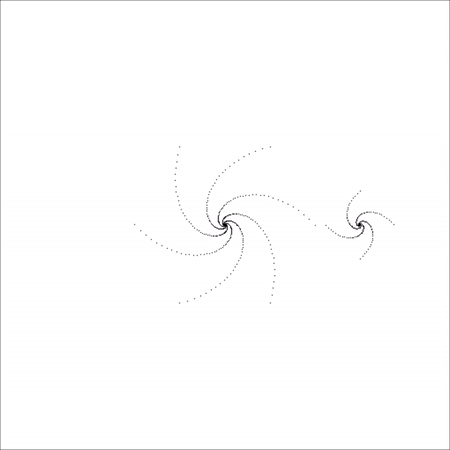

# N(o)body

2D simulation of the astrophysical [n-body problem](https://en.wikipedia.org/wiki/N-body_problem),
optionally distributed using MPI and OpenMP.

## Compilation

Simply `make` the project and execute the resulting executable `nbody`.

## Input

The input to the simulation is a text file describing the simulated bodies.
While the first line gives the total number of bodies, all subsequent lines 
describe these bodies by specifying their

- inertial mass
- initial position vector
- initial velocity vector

with 5 floating point numbers in total. Example:

```
2                                 # two bodies
1.98e30   0         0  0  0       # the sun
5.977e24  1.496e11  0  0  29716   # the earth
```

## Putput

To start a simulation, call the compiled executable `nbody` with

```
nbody -i input -o output [-t step] [-n n_steps] [-d] [-s] [-p] [-3] [-l] [-W pixels] [-H pixels] [-w width] [-h width] [-A asteps]
```

where the parameters work as follows:

- `-i input`: Location of the initial body configuration
- `-o output`: Where to write the final body configuration
- `-t step`: Size of a simulation time step in seconds
- `-n n_steps`: Total number of time steps to simulate
- `-p`: Execute the simulation in parallel
- `-3`: Use Newton's third law for local performance optimization
- `-l`: Use Newton's third law for global performance optimization
- `-d`: Display helpful debugging output throughout execution
- `-W/-H pixels`: Output image width or height, respectively
- `-w width`: Width of depicted space in meters
- `-h height`: Height of depicted space in meters
- `-A asteps`: Steps between two images. If zero, no images will be generated.


## Output

The output of the simulation is two-fold:

1. The output file specified by `-o` has the same format as the input file given by `-i` but contains the location and velocity of the bodies at the *end* of the simulation.
2. In addition, every `-A` (if not zero) time steps an image file of `-W x -H` pixels will be generated depicting the current position of the bodies in a physical area of size `-w x -h`.

## Example

When using [this input configuration](twogalaxies_in.dat) of two spiral galaxies, simulating 100 steps of 3.16e10 seconds yields [this output file](twogalaxies_out.dat). The animated GIF below shows the sequence of images generated in between.

